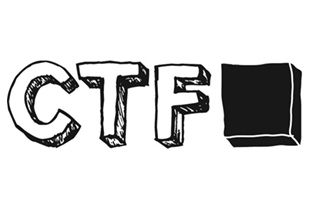

## Some CTFs
List of VM:
- [x] 42Challenge  [--> Link](https://github.com/ArtPes/CTF/tree/master/42Challenge)  [==> Download](#)
- [x] bossplayer  [--> Link](https://github.com/ArtPes/CTF/tree/master/bossplayer)  [==> Download](#)
- [x] Broken_2020  [--> Link](https://github.com/ArtPes/CTF/tree/master/Broken_2020)  [==> Download](#)
- [x] BTRsys-2  [--> Link](https://github.com/ArtPes/CTF/tree/master/BTRsys-2)  [==> Download](#)
- [x] CengBox:1  [--> Link](https://github.com/ArtPes/CTF/tree/master/CengBox:1)  [==> Download](#)
- [x] CengBox:2  [--> Link](https://github.com/ArtPes/CTF/tree/master/CengBox:2)  [==> Download](#)
- [x] CK:00  [--> Link](https://github.com/ArtPes/CTF/tree/master/CK:00)  [==> Download](#)
- [x] CloudAV  [--> Link](https://github.com/ArtPes/CTF/tree/master/CloudAV)  [==> Download](#)
- [x] Connect_the_Dots  [--> Link](https://github.com/ArtPes/CTF/tree/master/Connect_the_Dots)  [==> Download](#)
- [x] CTF_KFIOFan1  [--> Link](https://github.com/ArtPes/CTF/tree/master/CTF_KFIOFan1)  [==> Download](#)
- [x] CTF_KFIOFan2  [--> Link](https://github.com/ArtPes/CTF/tree/master/CTF_KFIOFan2)  [==> Download](#)
- [x] Cybero  [--> Link](https://github.com/ArtPes/CTF/tree/master/Cybero)  [==> Download](#)
- [x] DC_1  [--> Link](https://github.com/ArtPes/CTF/tree/master/DC_1)  [==> Download](#)
- [x] DC_2  [--> Link](https://github.com/ArtPes/CTF/tree/master/DC_2)  [==> Download](#)
- [x] DC_3  [--> Link](https://github.com/ArtPes/CTF/tree/master/DC_3)  [==> Download](#)
- [x] DC_4  [--> Link](https://github.com/ArtPes/CTF/tree/master/DC_4)  [==> Download](#)
- [x] DC_5  [--> Link](https://github.com/ArtPes/CTF/tree/master/DC_5)  [==> Download](#)
- [x] DC_6  [--> Link](https://github.com/ArtPes/CTF/tree/master/DC_6)  [==> Download](#)
- [x] DC_7  [--> Link](https://github.com/ArtPes/CTF/tree/master/DC_7)  [==> Download](#)
- [x] DC_8  [--> Link](https://github.com/ArtPes/CTF/tree/master/DC_8)  [==> Download](#)
- [x] DC_9  [--> Link](https://github.com/ArtPes/CTF/tree/master/DC_9)  [==> Download](#)
- [x] Death_Star:1  [--> Link](https://github.com/ArtPes/CTF/tree/master/Death_Star:1)  [==> Download](#)
- [x] Deception  [--> Link](https://github.com/ArtPes/CTF/tree/master/Deception)  [==> Download](#)
- [x] devrandomCTF  [--> Link](https://github.com/ArtPes/CTF/tree/master/devrandomCTF)  [==> Download](#)
- [x] DevrandomCTF_1  [--> Link](https://github.com/ArtPes/CTF/tree/master/DevrandomCTF_1)  [==> Download](#)
- [x] dijin_1  [--> Link](https://github.com/ArtPes/CTF/tree/master/dijin_1)  [==> Download](#)
- [x] Escalate_my_Privilege  [--> Link](https://github.com/ArtPes/CTF/tree/master/Escalate_my_Privilege)  [==> Download](#)
- [x] EVM  [--> Link](https://github.com/ArtPes/CTF/tree/master/EVM)  [==> Download](#)
- [x] Five86_1  [--> Link](https://github.com/ArtPes/CTF/tree/master/Five86_1)  [==> Download](#)
- [x] Five86_2  [--> Link](https://github.com/ArtPes/CTF/tree/master/Five86_2)  [==> Download](#)
- [x] Geisha  [--> Link](https://github.com/ArtPes/CTF/tree/master/Geisha)  [==> Download](#)
- [x] GitRoot  [--> Link](https://github.com/ArtPes/CTF/tree/master/GitRoot)  [==> Download](#)
- [x] GoldenEye-v1  [--> Link](https://github.com/ArtPes/CTF/tree/master/GoldenEye-v1)  [==> Download](#)
- [x] HA_Armour  [--> Link](https://github.com/ArtPes/CTF/tree/master/HA_Armour)  [==> Download](#)
- [x] HA_Chakravyuh  [--> Link](https://github.com/ArtPes/CTF/tree/master/HA_Chakravyuh)  [==> Download](#)
- [x] HA_Chanakya  [--> Link](https://github.com/ArtPes/CTF/tree/master/HA_Chanakya)  [==> Download](#)
- [x] haclabs:deception  [--> Link](https://github.com/ArtPes/CTF/tree/master/haclabs:deception)  [==> Download](#)
- [x] haclabs:deception1.1  [--> Link](https://github.com/ArtPes/CTF/tree/master/haclabs:deception1.1)  [==> Download](#)
- [x] haclabs:no_name  [--> Link](https://github.com/ArtPes/CTF/tree/master/haclabs:no_name)  [==> Download](#)
- [x] HA_Dhanush  [--> Link](https://github.com/ArtPes/CTF/tree/master/HA_Dhanush)  [==> Download](#)
- [x] HA_Infinity_Stones  [--> Link](https://github.com/ArtPes/CTF/tree/master/HA_Infinity_Stones)  [==> Download](#)
- [x] HA_Isro  [--> Link](https://github.com/ArtPes/CTF/tree/master/HA_Isro)  [==> Download](#)
- [x] HA_Joker  [--> Link](https://github.com/ArtPes/CTF/tree/master/HA_Joker)  [==> Download](#)
- [x] HA_Naruto  [--> Link](https://github.com/ArtPes/CTF/tree/master/HA_Naruto)  [==> Download](#)
- [x] HA_Rudra  [--> Link](https://github.com/ArtPes/CTF/tree/master/HA_Rudra)  [==> Download](#)
- [x] HA_Wordy  [--> Link](https://github.com/ArtPes/CTF/tree/master/HA_Wordy)  [==> Download](#)
- [x] homeless  [--> Link](https://github.com/ArtPes/CTF/tree/master/homeless)  [==> Download](#)
- [x] Inclusiveness  [--> Link](https://github.com/ArtPes/CTF/tree/master/Inclusiveness)  [==> Download](#)
- [x] InfoSecWarrior_CTF_2020:01  [--> Link](https://github.com/ArtPes/CTF/tree/master/InfoSecWarrior_CTF_2020:01)  [==> Download](#)
- [x] InfoSecWarrior_CTF_2020:03  [--> Link](https://github.com/ArtPes/CTF/tree/master/InfoSecWarrior_CTF_2020:03)  [==> Download](#)
- [x] Inplainsight  [--> Link](https://github.com/ArtPes/CTF/tree/master/Inplainsight)  [==> Download](#)
- [x] ItsOctober  [--> Link](https://github.com/ArtPes/CTF/tree/master/ItsOctober)  [==> Download](#)
- [x] Katana  [--> Link](https://github.com/ArtPes/CTF/tree/master/Katana)  [==> Download](#)
- [x] Kioptrix_1  [--> Link](https://github.com/ArtPes/CTF/tree/master/Kioptrix_1)  [==> Download](#)
- [x] Kioptrix_2  [--> Link](https://github.com/ArtPes/CTF/tree/master/Kioptrix_2)  [==> Download](#)
- [x] Kioptrix_3  [--> Link](https://github.com/ArtPes/CTF/tree/master/Kioptrix_3)  [==> Download](#)
- [x] lazysysadmin  [--> Link](https://github.com/ArtPes/CTF/tree/master/lazysysadmin)  [==> Download](#)
- [x] Lemonqueezy  [--> Link](https://github.com/ArtPes/CTF/tree/master/Lemonqueezy)  [==> Download](#)
- [x] literallyvulnerable  [--> Link](https://github.com/ArtPes/CTF/tree/master/literallyvulnerable)  [==> Download](#)
- [x] Lord_of_the_root  [--> Link](https://github.com/ArtPes/CTF/tree/master/Lord_of_the_root)  [==> Download](#)
- [x] maskcrafter  [--> Link](https://github.com/ArtPes/CTF/tree/master/maskcrafter)  [==> Download](#)
- [x] Matrix_v3  [--> Link](https://github.com/ArtPes/CTF/tree/master/Matrix_v3)  [==> Download](#)
- [x] Me_and_My_Girlfriend_1  [--> Link](https://github.com/ArtPes/CTF/tree/master/Me_and_My_Girlfriend_1)  [==> Download](#)
- [x] metasploitable  [--> Link](https://github.com/ArtPes/CTF/tree/master/metasploitable)  [==> Download](#)
- [x] Metasploitable2  [--> Link](https://github.com/ArtPes/CTF/tree/master/Metasploitable2)  [==> Download](#)
- [x] mhz_c1f  [--> Link](https://github.com/ArtPes/CTF/tree/master/mhz_c1f)  [==> Download](#)
- [x] Mordor  [--> Link](https://github.com/ArtPes/CTF/tree/master/Mordor)  [==> Download](#)
- [x] Mr_Robot  [--> Link](https://github.com/ArtPes/CTF/tree/master/Mr_Robot)  [==> Download](#)
- [x] MyTomcatHost  [--> Link](https://github.com/ArtPes/CTF/tree/master/MyTomcatHost)  [==> Download](#)
- [x] nezuko  [--> Link](https://github.com/ArtPes/CTF/tree/master/nezuko)  [==> Download](#)
- [x] Nightfall  [--> Link](https://github.com/ArtPes/CTF/tree/master/Nightfall)  [==> Download](#)
- [x] Os-ByteSec  [--> Link](https://github.com/ArtPes/CTF/tree/master/Os-ByteSec)  [==> Download](#)
- [x] Os-HackNos-1  [--> Link](https://github.com/ArtPes/CTF/tree/master/Os-HackNos-1)  [==> Download](#)
- [x] Os-HackNos-2  [--> Link](https://github.com/ArtPes/CTF/tree/master/Os-HackNos-2)  [==> Download](#)
- [x] Os-HackNos-3  [--> Link](https://github.com/ArtPes/CTF/tree/master/Os-HackNos-3)  [==> Download](#)
- [x] Os-Hax  [--> Link](https://github.com/ArtPes/CTF/tree/master/Os-Hax)  [==> Download](#)
- [x] PumpkinFestival  [--> Link](https://github.com/ArtPes/CTF/tree/master/PumpkinFestival)  [==> Download](#)
- [x] PumpkinGarden  [--> Link](https://github.com/ArtPes/CTF/tree/master/PumpkinGarden)  [==> Download](#)
- [x] PumpkinRaising  [--> Link](https://github.com/ArtPes/CTF/tree/master/PumpkinRaising)  [==> Download](#)
- [x] PumpkinsFestival  [--> Link](https://github.com/ArtPes/CTF/tree/master/PumpkinsFestival)  [==> Download](#)
- [x] pwnlab:init  [--> Link](https://github.com/ArtPes/CTF/tree/master/pwnlab:init)  [==> Download](#)
- [x] README.md.bak  [--> Link](https://github.com/ArtPes/CTF/tree/master/README.md.bak)  [==> Download](#)
- [x] README_new.md  [--> Link](https://github.com/ArtPes/CTF/tree/master/README_new.md)  [==> Download](#)
- [x] recon:1  [--> Link](https://github.com/ArtPes/CTF/tree/master/recon:1)  [==> Download](#)
- [x] ReconForce_01  [--> Link](https://github.com/ArtPes/CTF/tree/master/ReconForce_01)  [==> Download](#)
- [x] RickdiculouslyEasy  [--> Link](https://github.com/ArtPes/CTF/tree/master/RickdiculouslyEasy)  [==> Download](#)
- [x] sahu  [--> Link](https://github.com/ArtPes/CTF/tree/master/sahu)  [==> Download](#)
- [x] seppuku  [--> Link](https://github.com/ArtPes/CTF/tree/master/seppuku)  [==> Download](#)
- [x] Silky_0x01  [--> Link](https://github.com/ArtPes/CTF/tree/master/Silky_0x01)  [==> Download](#)
- [x] Silky_0x02  [--> Link](https://github.com/ArtPes/CTF/tree/master/Silky_0x02)  [==> Download](#)
- [x] Sputnik  [--> Link](https://github.com/ArtPes/CTF/tree/master/Sputnik)  [==> Download](#)
- [x] Stapler  [--> Link](https://github.com/ArtPes/CTF/tree/master/Stapler)  [==> Download](#)
- [x] Star_Wars_1  [--> Link](https://github.com/ArtPes/CTF/tree/master/Star_Wars_1)  [==> Download](#)
- [x] Sumo  [--> Link](https://github.com/ArtPes/CTF/tree/master/Sumo)  [==> Download](#)
- [x] sunset:dawn2  [--> Link](https://github.com/ArtPes/CTF/tree/master/sunset:dawn2)  [==> Download](#)
- [x] sunset:dusk  [--> Link](https://github.com/ArtPes/CTF/tree/master/sunset:dusk)  [==> Download](#)
- [x] sunset:nightfall  [--> Link](https://github.com/ArtPes/CTF/tree/master/sunset:nightfall)  [==> Download](#)
- [x] sunset:sunrise  [--> Link](https://github.com/ArtPes/CTF/tree/master/sunset:sunrise)  [==> Download](#)
- [x] Symfonos_5  [--> Link](https://github.com/ArtPes/CTF/tree/master/Symfonos_5)  [==> Download](#)
- [x] TBBT:FunWithFlags  [--> Link](https://github.com/ArtPes/CTF/tree/master/TBBT:FunWithFlags)  [==> Download](#)
- [x] TempusFugit_2  [--> Link](https://github.com/ArtPes/CTF/tree/master/TempusFugit_2)  [==> Download](#)
- [x] TempusFugit_3  [--> Link](https://github.com/ArtPes/CTF/tree/master/TempusFugit_3)  [==> Download](#)
- [x] Tr0ll2  [--> Link](https://github.com/ArtPes/CTF/tree/master/Tr0ll2)  [==> Download](#)
- [x] Tr0ll3  [--> Link](https://github.com/ArtPes/CTF/tree/master/Tr0ll3)  [==> Download](#)
- [x] tre  [--> Link](https://github.com/ArtPes/CTF/tree/master/tre)  [==> Download](#)
- [x] Victim:1  [--> Link](https://github.com/ArtPes/CTF/tree/master/Victim:1)  [==> Download](#)
- [x] Wakanda:1  [--> Link](https://github.com/ArtPes/CTF/tree/master/Wakanda:1)  [==> Download](#)
- [x] West_Wild_1_1  [--> Link](https://github.com/ArtPes/CTF/tree/master/West_Wild_1_1)  [==> Download](#)
- [x] Zion:1  [--> Link](https://github.com/ArtPes/CTF/tree/master/Zion:1)  [==> Download](#)

Number of VMs rooted: 110

VMs of HackTheBox: HackTheBox