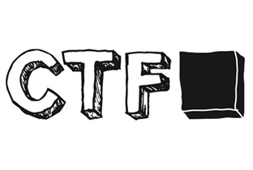

## Some CTFs
List of VM:
- [x] 42Challenge  [--> Link](#)
- [x] bossplayer  [--> Link](#)
- [x] Broken_2020  [--> Link](#)
- [x] BTRsys-2  [--> Link](#)
- [x] CengBox:1  [--> Link](#)
- [x] CK:00  [--> Link](#)
- [x] CloudAV  [--> Link](#)
- [x] Connect_the_Dots  [--> Link](#)
- [x] CTF_KFIOFan1  [--> Link](#)
- [x] CTF_KFIOFan2  [--> Link](#)
- [x] DC_1  [--> Link](#)
- [x] DC_2  [--> Link](#)
- [x] DC_3  [--> Link](#)
- [x] DC_4  [--> Link](#)
- [x] DC_5  [--> Link](#)
- [x] DC_6  [--> Link](#)
- [x] DC_7  [--> Link](#)
- [x] DC_8  [--> Link](#)
- [x] DC_9  [--> Link](#)
- [x] Death_Star:1  [--> Link](#)
- [x] devrandomCTF  [--> Link](#)
- [x] DevrandomCTF_1  [--> Link](#)
- [x] dijin_1  [--> Link](#)
- [x] Escalate_my_Privilege  [--> Link](#)
- [x] EVM  [--> Link](#)
- [x] Five86_1  [--> Link](#)
- [x] Five86_2  [--> Link](#)
- [x] Geisha  [--> Link](#)
- [x] HA_Armour  [--> Link](#)
- [x] HA_Chakravyuh  [--> Link](#)
- [x] HA_Chanakya  [--> Link](#)
- [x] haclabs:deception  [--> Link](#)
- [x] haclabs:deception1.1  [--> Link](#)
- [x] haclabs:no_name  [--> Link](#)
- [x] HA_Dhanush  [--> Link](#)
- [x] HA_Infinity_Stones  [--> Link](#)
- [x] HA_Isro  [--> Link](#)
- [x] HA_Joker  [--> Link](#)
- [x] HA_Naruto  [--> Link](#)
- [x] HA_Rudra  [--> Link](#)
- [x] HA_Wordy  [--> Link](#)
- [x] homeless  [--> Link](#)
- [x] Inclusiveness  [--> Link](#)
- [x] InfoSecWarrior_CTF_2020:01  [--> Link](#)
- [x] InfoSecWarrior_CTF_2020:03  [--> Link](#)
- [x] Katana  [--> Link](#)
- [x] Kioptrix_1  [--> Link](#)
- [x] Kioptrix_2  [--> Link](#)
- [x] Kioptrix_3  [--> Link](#)
- [x] lazysysadmin  [--> Link](#)
- [x] Lemonqueezy  [--> Link](#)
- [x] literallyvulnerable  [--> Link](#)
- [x] Lord_of_the_root  [--> Link](#)
- [x] maskcrafter  [--> Link](#)
- [x] Matrix_v3  [--> Link](#)
- [x] Me_and_My_Girlfriend_1  [--> Link](#)
- [x] metasploitable  [--> Link](#)
- [x] Metasploitable2  [--> Link](#)
- [x] mhz_c1f  [--> Link](#)
- [x] Mordor  [--> Link](#)
- [x] Mr_Robot  [--> Link](#)
- [x] MyTomcatHost  [--> Link](#)
- [x] nezuko  [--> Link](#)
- [x] Nightfall  [--> Link](#)
- [x] Os-ByteSec  [--> Link](#)
- [x] Os-HackNos-1  [--> Link](#)
- [x] Os-HackNos-2  [--> Link](#)
- [x] Os-HackNos-3  [--> Link](#)
- [x] Os-Hax  [--> Link](#)
- [x] PumpkinFestival  [--> Link](#)
- [x] PumpkinGarden  [--> Link](#)
- [x] PumpkinRaising  [--> Link](#)
- [x] PumpkinsFestival  [--> Link](#)
- [x] pwnlab:init  [--> Link](#)
- [x] README2.md  [--> Link](#)
- [x] README_new.md  [--> Link](#)
- [x] recon:1  [--> Link](#)
- [x] ReconForce_01  [--> Link](#)
- [x] RickdiculouslyEasy  [--> Link](#)
- [x] sahu  [--> Link](#)
- [x] Silky_0x01  [--> Link](#)
- [x] Silky_0x02  [--> Link](#)
- [x] Sputnik  [--> Link](#)
- [x] Stapler  [--> Link](#)
- [x] Sumo  [--> Link](#)
- [x] sunset:dawn2  [--> Link](#)
- [x] sunset:dusk  [--> Link](#)
- [x] sunset:nightfall  [--> Link](#)
- [x] sunset:sunrise  [--> Link](#)
- [x] Symfonos_5  [--> Link](#)
- [x] TBBT:FunWithFlags  [--> Link](#)
- [x] TempusFugit_2  [--> Link](#)
- [x] TempusFugit_3  [--> Link](#)
- [x] Tools  [--> Link](#)
- [x] Tr0ll2  [--> Link](#)
- [x] Tr0ll3  [--> Link](#)
- [x] Victim:1  [--> Link](#)
- [x] Wakanda:1  [--> Link](#)
- [x] West_Wild_1_1  [--> Link](#)
- [x] Zion:1  [--> Link](#)

Number of VMs rooted: 101
VMs of HackTheBox: HackTheBox